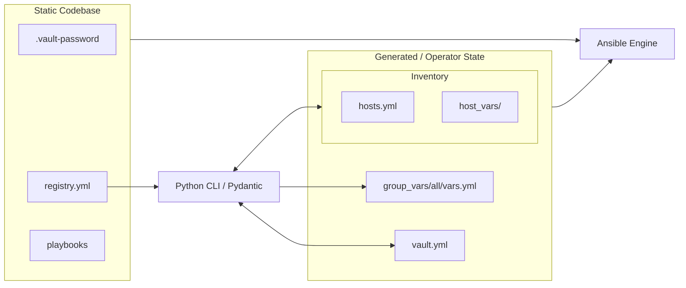
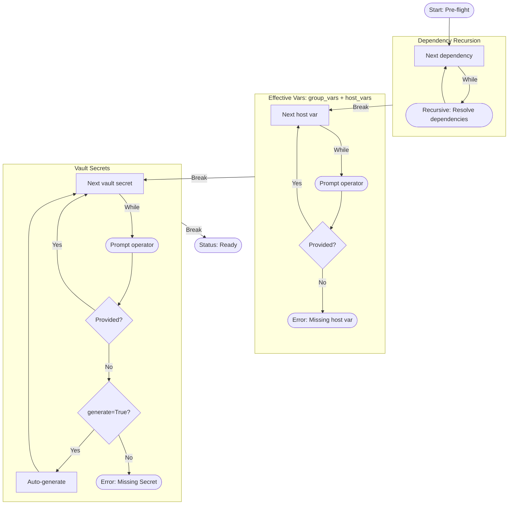
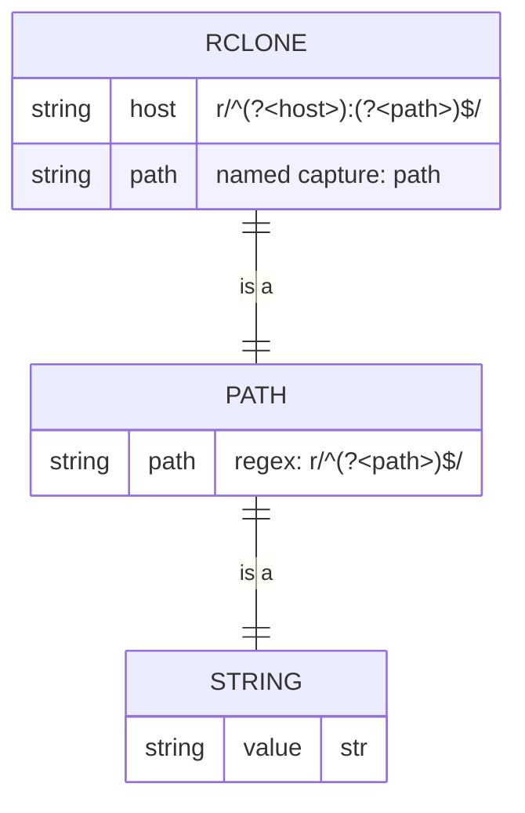

# Project Specs

<!-- 
TODO: Formalize these points:

	- Ansible is the main, stand-alone project. It's strictly declarative. Python exists solely to modify the declaration files.
	- Lean app agnostic for testing.
	- Define terraform logic and states.
	- Reference enforcers for every statement in the doc.
-->

## System Architecture



### Architectural Boundaries

- **Python** handles interactive data gathering and compiles the registry into Ansible variables (`make generate-apps`).
- **Ansible** handles system convergence. Python must never call ansible-playbook.

## Scaffolding

```text
ansible/
  registry.yml           # Single source of truth for all app metadata
  apps/<app>/            # Ansible role per app
    defaults/main.yml    # Hand-authored defaults (nulls for required vars ONLY)
    tasks/main.yml       # Standardized 4-step task pattern
    playbook.yml         # Committed; import_playbook chain + pre_tasks
  roles/                 # Shared roles (service_adapter, rclone, podman)
  group_vars/
    all/
      vars.yml           # GENERATED (gitignored) — service names, ports, shared_vars from registry
      vault.yml          # GENERATED — Encrypted secrets (ansible-vault)
  inventory/             # GENERATED/HAND-EDITABLE — Managed via `make config-hosts-*`

linux_hi/
  adapters/              # I/O ports (connection types, prompters, info port)
  cli/                   # Operator-facing entry points
  models/
    ansible/             # Typed access boundaries (registry, host_vars, connection, role_vars)
    inventory/           # Inventory-backed model types (vault secrets schema)
    system/              # System info shapes (blockdevice, mount)
  policy/                # Structural repo checks (run via TestRepoPolicy)
  services/              # Business logic (vault, preflight, mount orchestration)
  storage/               # Storage domain (device discovery, display, rclone)
  utils/                 # Generic helpers (subprocess execution)

tests/
  apps/                  # App-specific contract tests
  e2e/                   # Requires live host
  support/               # Shared test infrastructure (fakes, fixtures, data)
  unit/                  # Fast unit + lint tests
```

## Bootstrap / Terraform Roles

Before any app can be provisioned, the target host must satisfy a set of base conditions. Infrastructure roles live in `ansible/roles/` and run as root. They are idempotent, run against a stock Linux install, and do not depend on any app registry entry.

All infrastructure roles live in `ansible/roles/`, run as root, and are provisioned by `make setup` (`ansible/playbooks/setup.yml`). They are idempotent and have no dependency on any app registry entry.

### Setup Roles (`make setup`)

`auto-updates`, `podman`, `caddy`, and `rclone` are multi-distro: each contains a `pkg_<manager>.yml` include gated by `ansible_facts['pkg_mgr']`. A role fails early with a clear message if the host's package manager is unsupported and `<role>_fail_on_unsupported` is true (default for `podman`; lenient for `auto-updates`).

| Role | Tag | Purpose |
| :--- | :--- | :--- |
| `auto-updates` | `base` | Configures unattended package upgrades (distro-appropriate: apt, dnf, zypper, apk, pacman) |
| `podman` | `podman` | Installs rootless Podman, the container runtime required by all app roles |
| `rclone` | `base` | Installs rclone and deploys the vault-backed config; required by backup/restore workflows |
| `caddy` | `caddy` | Native Caddy 2.x reverse proxy and ACME TLS terminator. Installed via apt, runs as the system `caddy` user on ports 80/443. Required before any app needs HTTPS. Routes are declared as a `caddy_routes` list in host_vars (each entry: `host` label, `external` domain, `internal` backend address). Duplicate external or internal addresses are rejected at runtime. |

### Ordering Contract

```text
make setup           # Infrastructure: auto-updates + podman + rclone + caddy  ← must run first
make <app>           # App layer: runs preflight, then app playbook
```

`setup.yml` is safe to re-run at any time. On a correctly provisioned host, run 2 produces zero failures and near-zero changed tasks. The E2E test suite asserts this property (`tests/e2e/test_setup_idempotency.py`).

* * *

## Pre-Provisioning Logic

When a user requests an app (`make <app>`), the Python layer guarantees all dependencies, host variables, and secrets are satisfied before Ansible is invoked.

**Var resolution order (highest precedence last):** `group_vars/all/vars.yml` → `host_vars/<hostname>.yml`. The preflight checks this full effective set before prompting — a var already set in `group_vars/all/` is never re-prompted and never written to `host_vars/`. When a var is missing, the operator is prompted and the value is written to `host_vars/<hostname>.yml` only.



## Input Var Types

### Prompt Types

Each var spec declares a prompt type that determines how the operator is asked for a value:

| Type | Behavior |
| :--- | :--- |
| `text` | Free-text input, value shown as typed |
| `password` | Masked input, value hidden from terminal |
| `path` | Path input with home/env expansion and normalized output |
| `rclone_remote` | Selection from configured remotes stored in vault; prompts for host then path |

### Value Formats

All input types are strings, separated only by format. They need to be in order to 'fit' our file-declarative model.



### Prompt Flow

- **`rclone_remote`** → Select configured remote → Prompt for path → stored as `<host>:<path>`
- **`path`** → Path prompt → `~`/env expansion + normalization → stored as string path
- **`text` / `password`** → Single prompt → stored as plain string

## Commands

### Edit Configs

| Target | Variables | Command |
| :--- | :---: | ---: |
| `make config-rclone` | `-` | `rclone config --config config/rclone.conf` |
| `make config-hosts-add` | `<name:str> <address:str> <secret:path>` | `poetry run python -m linux_hi.cli.hosts add --name <name> --address <address> --secret <secret>` |
| `make config-hosts-remove` | `<name:str>` | `poetry run python -m linux_hi.cli.hosts remove --name <name>` |
| `make config-hosts-list` | `-` | `poetry run python -m linux_hi.cli.hosts list` |
| `make config-vault-list` | `-` | `poetry run python -m linux_hi.cli.vault list` |

### Lint

Run `make lint` to run all of the following:

| **Command** | Command | Config(s) |
| --- | --- | --- |
| `make lint-ansible` | `poetry run ansible-lint ansible` | `<root>/ansible/ansible.cfg` |
| `make lint-ansible-coverage` | `poetry run python -m linux_hi.cli.linters.ansible_coverage` | `config/lint.toml → [ansible_coverage]` |
| `make lint-ansible-roles-coverage` | `poetry run python -m linux_hi.cli.linters.ansible_roles_coverage` | `config/lint.toml → [ansible_roles_coverage]` |
| `make lint-check` | `poetry run ruff check` | `<root>/pyproject.toml` |
| `make lint-coverage` | `poetry run python -m linux_hi.cli.linters.coverage` | `<root>/config/lint.toml` |
| `make lint-format` | `poetry run ruff format --check` | `<root>/pyproject.toml` |
| `make lint-ty` | `poetry run ty check` | `<root>/pyproject.toml` |
| `make lint-checkmake` | `poetry run mbake format --check Makefile` | `-` |
| `make lint-cpd` | `npx jscpd --config config/jscpd.json .` | `config/jscpd.json` |
| `make lint-repo-policy` | `poetry run python -m linux_hi.cli.repo_policy_check` | `-` |
| `make lint-semgrep` | `poetry run semgrep scan --config rules/ --error` | `<root>/rules/**/*.yml` |
| `make lint-lizard` | `poetry run python -m linux_hi.cli.linters.lizard` | `<root>/config/lint.toml` |
| `make lint-vulture` | `poetry run python -m linux_hi.cli.linters.vulture` | `<root>/config/lint.toml` |

### Debug

| **Command** | Command |
| --- | --- |
| `make ssh` | `poetry run python -m linux_hi.cli.rclone` |
| `make test` | `poetry run pytest tests/ -v` |
| `make test-e2e` | `HOST=$(HOST) poetry run pytest tests/e2e/ -v -m e2e -s` |
| `make check` | `poetry run python -m linux_hi.cli.check` |
| `make ping` | \`ansible devices -m ping -i \$(INV) |
