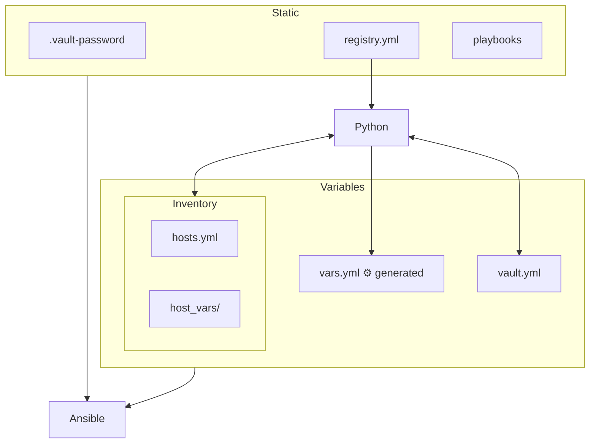

# Specs

- `Python` can edit Ansible's config files.
- `Ansible` *must* be able to run independently.

## Flow Graph

## Commands

### Edit Configs

Pattern: config-&lt;target&gt;-&lt;action&gt; \[VARIABLES\]

#### Rclone

| Target | Variables | Command |
| :--- | :---: | ---: |
| `make config-rclone` | `-` | `rclone config --config config/rclone.conf` |

#### Hosts

| Target | Variables | Command |
| :--- | :---: | ---: |
| `make config-hosts-add` | `<name:str> <address:str> <secret:path>` | `poetry run python -m linux_hi.cli.hosts add --name <name> --address <address> --secret <secret>` |
| `make config-hosts-remove` | `<name:str>` | `poetry run python -m linux_hi.cli.hosts remove --name <name>` |
| `make config-hosts-list` | `-` | `poetry run python -m linux_hi.cli.hosts list` |

#### Vault

| Target | Variables | Command |
| :--- | :---: | ---: |
| `make config-vault-add` | `<name:str>` | `poetry run python -m linux_hi.cli.vault add --name <name>` |
| `make config-vault-remove` | `<name:str>` | `poetry run python -m linux_hi.cli.vault remove --name <name>` |
| `make config-vault-list` | `-` | `poetry run python -m linux_hi.cli.vault list` |

### Lint

Run `make lint` to run all of the following:

| **Command** | Command | Config(s) |
| --- | --- | --- |
| `make lint-ansible` | `poetry run ansible-lint ansible` | `<root>/ansible/ansible.cfg` |
| `make lint-check` | `poetry run ruff check` | `<root>/pyproject.toml` |
| `make lint-format` | `poetry run ruff format --check` | `<root>/pyproject.toml` |
| `make lint-ty` | `poetry run ty check` | `<root>/pyproject.toml` |
| `make lint-checkmake` | `poetry run mbake format --check Makefile` | `-` |
| `make lint-cpd` | `npx jscpd --config .jscpd.json .` | `<root>/.jscpd.json` |
| `make lint-repo-policy` | `poetry run python -m linux_hi.cli.repo_policy_check` | `-` |
| `make lint-semgrep` | `poetry run semgrep scan --config rules/ --error` | `<root>/rules/**/*.yml` |
| `make lint-lizard` | `poetry run python -m linux_hi.cli.lizard` | `<root>/config/lint.toml` |
| `make lint-vulture` | `poetry run python -m linux_hi.cli.vulture` | `<root>/config/lint.toml` |

### SSH

| **Command** | Command |
| --- | --- |
| `make ssh` | `poetry run python -m linux_hi.cli.rclone` |

### Debug

| **Command** | Command |
| --- | --- |
| `make test` | `poetry run pytest tests/ -v` |
| `make test-e2e` | `HOST=$(HOST) poetry run pytest tests/e2e/ -v -m e2e -s` |
| `make check` | `poetry run python -m linux_hi.cli.check` |
| `make ping` | \`ansible devices -m ping -i \$(INV) |

## Dependencies and Requirements

```mermaid
graph TD
  Start([Start]) --> SeenCheck{"Already visited?<br/>_seen set"}
  SeenCheck -- Yes --> Done([Done])
  SeenCheck -- No --> AddSeen[Add app to _seen]

  AddSeen --> AnyDeps{Has dependencies?}

  %% Dependency loop
  AnyDeps -- Yes --> NextDep[Get next dependency]
  NextDep --> RecursiveCall([Recursive call])
  RecursiveCall --> MoreDeps{More dependencies?}
  MoreDeps -- Yes --> NextDep
  MoreDeps -- No --> LoadSpec

  %% Load state once, upfront
  AnyDeps -- No --> LoadSpec["Load vars + secrets spec<br/>Read current host_vars + vault"]

  %% Host var collection
  LoadSpec --> AnyMissingVars{Missing host vars?}
  AnyMissingVars -- No --> AnyMissingSecrets
  AnyMissingVars -- Yes --> NextVar[Get next missing var]

  NextVar --> DispatchVar["PromptRegistry.prompt<br/>spec.type, label, default"]

  DispatchVar --> VarEmpty{Value empty?}
  VarEmpty -- Yes --> VarError([Error: required])
  VarEmpty -- No --> StoreVarUpdate[Add to host_updates]

  StoreVarUpdate --> MoreVars{More missing vars?}
  MoreVars -- Yes --> NextVar
  MoreVars -- No --> AnyMissingSecrets

  %% Secret collection
  AnyMissingSecrets{Missing secrets?} -- No --> WriteUpdates
  AnyMissingSecrets -- Yes --> NextSecret[Get next missing secret]

  NextSecret --> DispatchSecret["PromptRegistry.prompt<br/>hidden → 'password', else 'text'"]

  DispatchSecret --> SecretEmpty{Value empty?}
  SecretEmpty -- No --> StoreSecretUpdate[Add to secret_updates]
  SecretEmpty -- Yes --> CanGenerate{generate: true?}
  CanGenerate -- No --> SecretError([Error: required])
  CanGenerate -- Yes --> AutoGen["Auto-generate<br/>token_hex 32"]
  AutoGen --> StoreSecretUpdate

  StoreSecretUpdate --> MoreSecrets{More missing secrets?}
  MoreSecrets -- Yes --> NextSecret
  MoreSecrets -- No --> WriteUpdates

  %% Batched writes
  WriteUpdates["Write host_updates → inventory<br/>Write secret_updates → vault"] --> Done([Done])
```

